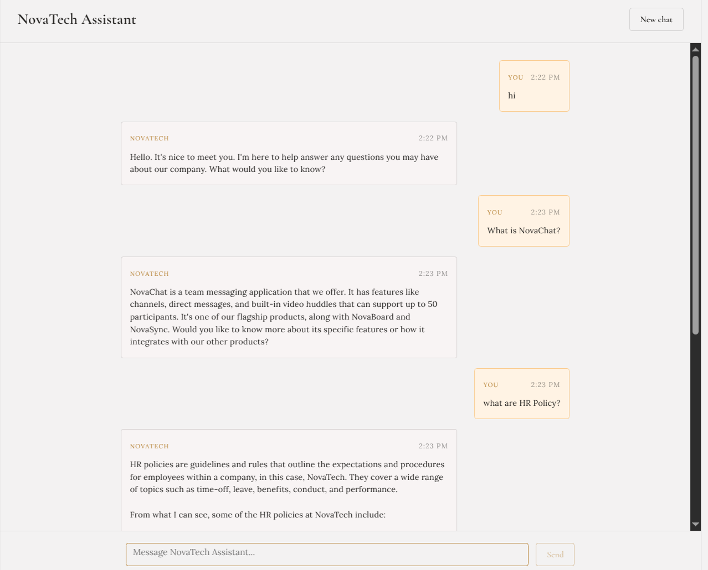
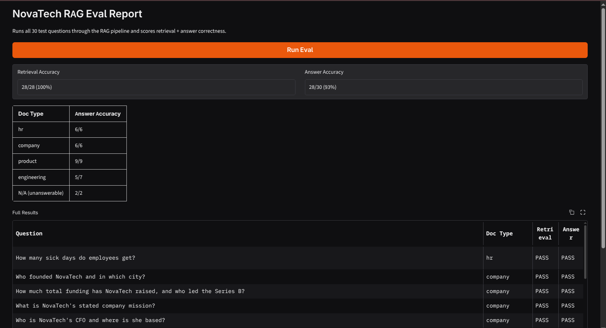

# NovaTech Assistant

A simple RAG (Retrieval-Augmented Generation) chatbot, built to learn how RAG works end-to-end — from a knowledge base, to a backend API, to a real chat UI, to testing if the answers are actually correct.

The chatbot answers questions about a fictional company called **NovaTech Systems** — its products, pricing, HR policies, and engineering setup — using only the documents provided to it, not general knowledge.



## What this project does

1. You ask a question in the chat.
2. The app searches a small database of NovaTech documents to find the most relevant pieces of text.
3. It sends those pieces of text, plus your question, to an LLM (large language model).
4. The LLM answers using only that text — and the UI shows you which documents it used as sources.

This is what "RAG" means: instead of the LLM guessing from what it was trained on, it looks things up first, then answers.

## Tech stack

| Part | Tool |
|---|---|
| Backend API | Django + Django REST Framework |
| Frontend | React (Vite) |
| Vector database | Chroma |
| Embeddings (turns text into searchable vectors) | HuggingFace (`all-MiniLM-L6-v2`) |
| LLM | Groq (`llama-3.3-70b-versatile`) |
| Evaluation UI | Gradio |

## The knowledge base

The chatbot only knows what's inside `backend/knowledge_base/`. It's a set of Markdown documents describing a made-up company, split into 4 folders:

- **`company/`** — who founded NovaTech, funding history, leadership team
- **`hr/`** — leave policy, sick days, parental leave, sabbaticals
- **`product/`** — pricing plans, product features (NovaBoard, NovaChat, NovaSync)
- **`engineering/`** — how the products are built (tech stack, architecture, deployment)

Each document is broken into small chunks and turned into embeddings, then stored in Chroma so the app can search them by meaning, not just keywords.

## How to run it

**1. Backend**
```bash
cd backend
pip install -r requirements.txt      # or use the project's virtual environment
python implementations/ingest.py     # builds the vector database from knowledge_base/
python manage.py runserver
```
You'll need a `.env` file with your `groq_api_key`.

**2. Frontend**
```bash
cd frontend
npm install
npm run dev
```
Open the URL it prints (usually `http://localhost:5173`).

## How we evaluated the LLM

Building a chatbot is easy. Knowing whether its answers are actually **correct** is the hard part. So we built a small evaluation (eval) system to check that.

### The eval dataset

`backend/implementations/eval_dataset.jsonl` has **30 test questions**, each with the fact the correct answer should contain. It's designed to stress-test the app, not just ask easy questions:

- **Straightforward questions** — one fact per document category (company, HR, product, engineering)
- **Follow-up questions** — questions that only make sense with earlier chat history (e.g. "How long is *it*?" after asking about parental leave) — this checks the app understands context, not just single questions
- **Trick questions** — like asking if the "Growth plan" in HR documents is the same as the pricing plan (it isn't — the two are unrelated)
- **Unanswerable questions** — questions with no answer anywhere in the knowledge base (e.g. "What is NovaTech's stock price?"). A good RAG app should say "I don't know" instead of making something up.
- **Hard questions** — ones that need combining facts from more than one document, or doing simple math on a retrieved number

### How scoring works

For every question, two things get checked:

1. **Retrieval check** — did the search step find a document from the right category?
2. **Answer check** — is the final answer actually correct?

The answer check uses **LLM-as-judge**: a second LLM call compares the chatbot's answer to the expected fact and replies YES or NO. This is more reliable than simple keyword matching, since it can tell a correctly *reworded* answer from a wrong one.

### Running the eval

You can run it two ways:

- **From the terminal:** `python backend/implementations/eval_runner.py` — prints a pass/fail report.
- **With a UI:** `python backend/implementations/eval_app.py` — opens a Gradio report in your browser with a "Run Eval" button, accuracy scores, and a full results table.



### What the eval found

In our last run: **28 out of 30 answers were correct (93%)**. The 2 failures were both in the `engineering` category — the correct information existed in the database, but didn't rank high enough in search to be picked up. This is a known limitation of the small embedding model used here, and a good example of why real RAG systems often add extra techniques like hybrid search or re-ranking.

## Known limitations

- Search sometimes misses the right document chunk for very specific technical questions, even when that chunk exists in the database (see the eval results above).
- No conversation history is saved between browser sessions — refreshing the page starts a new chat.
- This is a learning project, not a production app — things like authentication, rate limiting, and error monitoring are intentionally left out.
